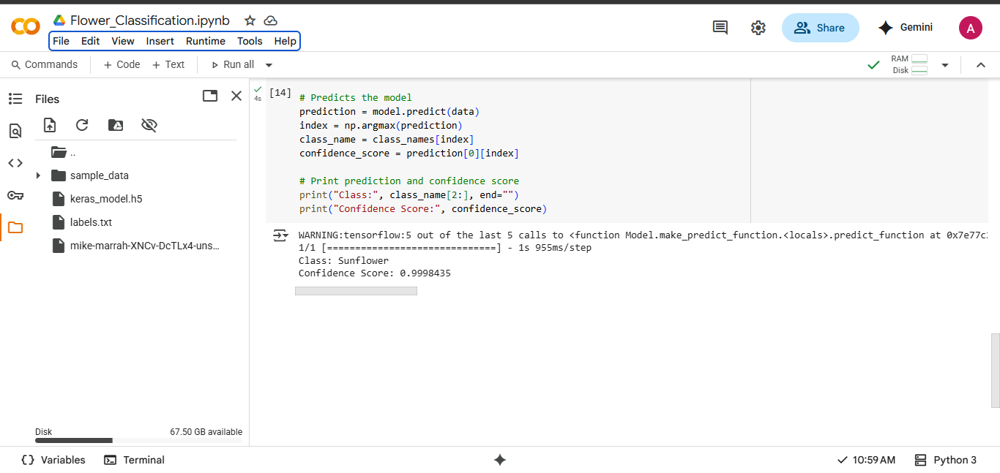

# Flower-Classification

---

## Project Title  
**Image Classification of Sunflower, Lily, and Tulip Flowers using Teachable Machine and Google Colab**

---

## Objective  
The objective of this project is to develop a simple image classification model that can distinguish between three different types of flowers: **Sunflower**, **Lily**, and **Tulip**. The model is trained using **Teachable Machine** and then deployed and tested in **Google Colab** using Python and TensorFlow.

---

## Description  
This project classifies flower images into three distinct classes:

- **Sunflower**
- **Lily**
- **Tulip**

A total of **30 images** (10 per class) were uploaded into the Teachable Machine platform to train the model. The trained model was then exported in TensorFlow/Keras format (`.h5`) and tested in **Google Colab** using Python code.

---

## Tools and Platform  
- **Training Tool**: [Teachable Machine](https://teachablemachine.withgoogle.com)  
- **Testing Platform**: [Google Colab](https://colab.research.google.com)  
- **Libraries**:
  - TensorFlow
  - keras
  - numpy
  - PIL
- **Model Format**: `.h5` (Keras/TensorFlow)

---

## Created By  
- **Student Name**: Aghadi Saleh Al-rebdi  
- **University**: Qassim University  
- **Department**: Computer Science  
- **Year**: 2025  

---

## Flower classification Code 

```python
from keras.models import load_model  # TensorFlow is required for Keras to work
from PIL import Image, ImageOps  # Install pillow instead of PIL
import numpy as np

# Disable scientific notation for clarity
np.set_printoptions(suppress=True)

# Load the model
model = load_model("/content/keras_model.h5", compile=False)

# Load the labels
class_names = open("labels.txt", "r").readlines()

# Create the array of the right shape to feed into the keras model
# The 'length' or number of images you can put into the array is
# determined by the first position in the shape tuple, in this case 1
data = np.ndarray(shape=(1, 224, 224, 3), dtype=np.float32)

# Replace this with the path to your image
image = Image.open("/content/mike-marrah-XNCv-DcTLx4-unsplash.jpg").convert("RGB")

# resizing the image to be at least 224x224 and then cropping from the center
size = (224, 224)
image = ImageOps.fit(image, size, Image.Resampling.LANCZOS)

# turn the image into a numpy array
image_array = np.asarray(image)

# Normalize the image
normalized_image_array = (image_array.astype(np.float32) / 127.5) - 1

# Load the image into the array
data[0] = normalized_image_array

# Predicts the model
prediction = model.predict(data)
index = np.argmax(prediction)
class_name = class_names[index]
confidence_score = prediction[0][index]

# Print prediction and confidence score
print("Class:", class_name[2:], end="")
print("Confidence Score:", confidence_score)

```

---
## Project Screenshot  
Below is a screenshot of the testing flower and the accuracy of the model  :





---

## Google Collab link

To see the code click here:
[](https://colab.research.google.com/github/Aghadi-alrebdi/Flower-Classification/blob/main/Flower_Classification.ipynb)


